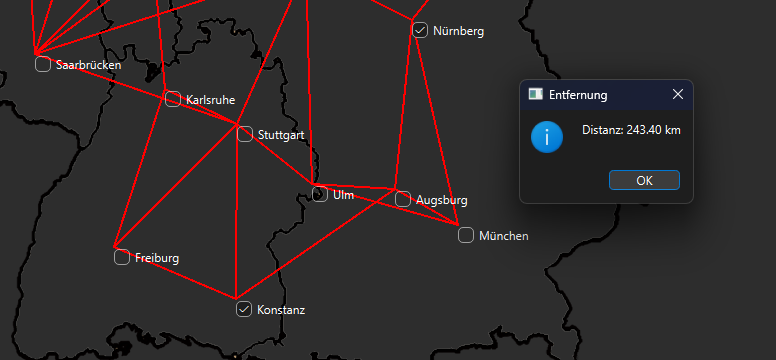
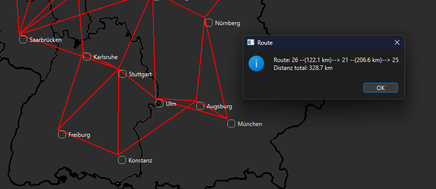
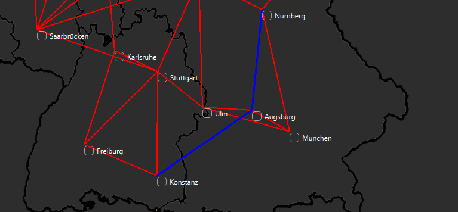
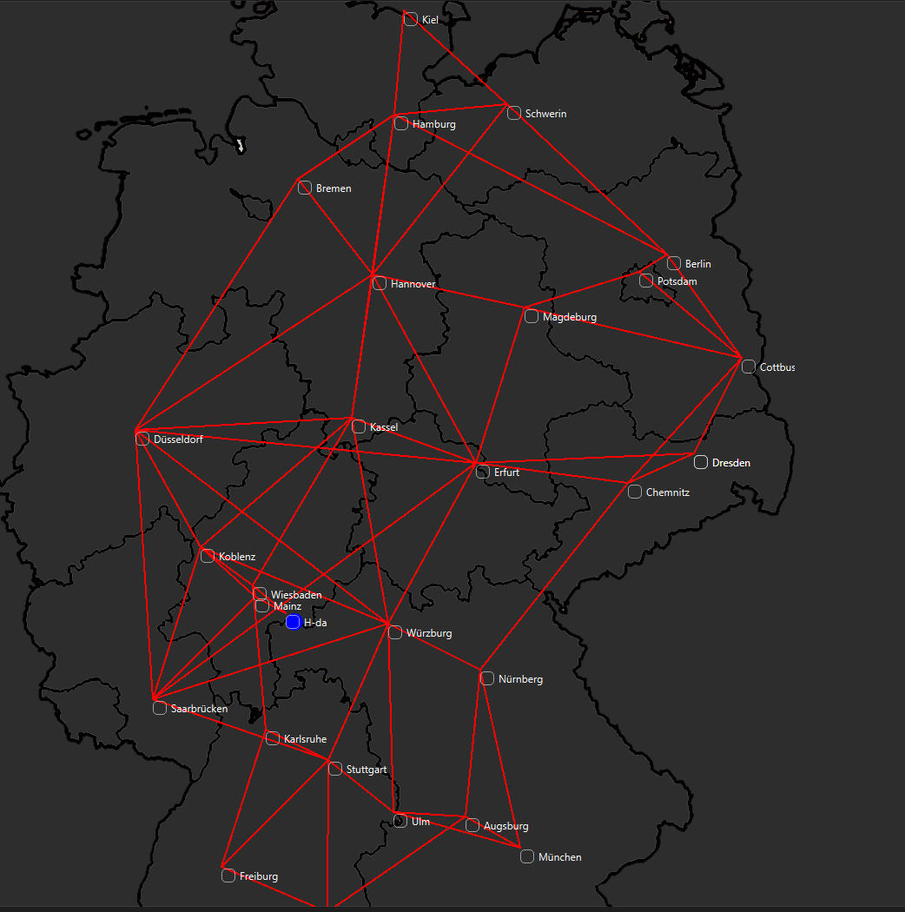

# C++ Navigation System with Qt GUI

This is one of my largest projects: a full-featured navigation system developed in **C++** with a **Qt**-based **Graphical User Interface (GUI)**. It allows you to:

- **Load maps** (various locations and points of interest),
- **Create new locations** (addresses or points of interest),
- **Calculate distances** between them,
- **Save** and **load** data to/from files,
- **Visualize** everything on an interactive map,
- **Perform routing** (shortest path-like functionality),
- and includes **unit tests** to ensure reliability.

Below you’ll find details on how the project is structured, its main features, and how to use it.

---

## Table of Contents
1. [Project Overview](#project-overview)
2. [Features](#features)
3. [Project Structure](#project-structure)
4. [Usage](#usage)
   - [Creating New Locations (anlegen)](#creating-new-locations)
   - [Saving Data (speichern)](#saving-data)
   - [Loading Data (laden)](#loading-data)
   - [Distance Calculation](#distance-calculation)
   - [Shortest Path (Routing)](#shortest-path-routing)
5. [Unit Tests](#unit-tests)
6. [Building & Running](#building--running)
7. [Screenshots / Demo](#screenshots--demo)
8. [Future Enhancements](#future-enhancements)
9. [License](#license)

---

## Project Overview

This navigation system uses an **interactive map** (displayed via a `QLabel` in Qt) where each **location** is marked. Distances can be calculated, and a rudimentary **routing** (similar to Dijkstra’s algorithm) is implemented to determine paths between points.

The solution is built using **Qt Creator**, making heavy use of:
- **Qt Widgets** for the GUI (e.g., `QMainWindow`, `QPushButton`, `QLabel`, `QCheckBox`)
- **Qt Dialogs** for user input (e.g., `QInputDialog`, `QFileDialog`, `QMessageBox`)
- **File I/O** to save and load location data (`.txt` files)

---

## Features

- **Map Loading & Display**  
  The GUI displays a base map (e.g., a map of Germany), with latitude/longitude ranges for conversion to screen coordinates.

- **Location Management**  
  - **Addresses** (with street name, house number, ZIP code, etc.)  
  - **Points of Interest (POI)** (with categories, remarks, etc.)  
  - Each location is assigned an **ID**.

- **Distance Calculation**  
  - **Haversine formula** for spherical distance in kilometers.  
  - Also an approximate formula based on degrees if desired.

- **Saving & Loading**  
  - Save the list of locations (addresses/POIs) to a `.txt` file.  
  - Load them back to restore a previous session.

- **Routing**  
  - Demonstrates a Dijkstra-like approach to find a path between two locations.  
  - Visual representation of paths on the map (color-coded lines).

- **Unit Tests**  
  - Basic tests (e.g., checking distance calculations, verifying location selection logic).

---

## Project Structure

A simplified overview of the classes and key files:

- **`mainwindow.cpp/.h`**  
  - Manages the main GUI, contains slots for button clicks (create location, move location, calculate distance, routing, etc.).
  - Handles painting (lines between locations, highlighting routes).

- **`ort.cpp/.h`**  
  - Base class for any location. Manages ID, latitude/longitude, neighbors, etc.

- **`adresse.cpp/.h`**  
  - Derived class for addresses (street name, house number, etc.).

- **`point_of_interest.cpp/.h`**  
  - Derived class for points of interest (category, remarks, etc.).

- **`meinort.cpp/.h`**  
  - A special class representing “My Location” (MeinOrt).

- **`test.cpp/.h`**  
  - Contains unit tests (using Qt test framework or similar) to ensure correctness.

- **UI Forms (`.ui` files)**  
  - Created/edited via Qt Designer for windows such as `MainWindow`.

---

## Usage

Once the application is running, you will see a **main window** containing:
1. A **map** (on the left or center).
2. Several **buttons** to create or remove locations, calculate distances, load/save data, etc.

### Creating New Locations (anlegen)

1. Click **Add Address** (or the corresponding button for POI).
2. In the popup dialogs, enter the required details:
   - **Coordinates** (latitude, longitude) within valid ranges.
   - For an address: street name, house number, ZIP code, city.
   - For a POI: category and a remark/note.
3. A **checkbox** marker appears on the map at the corresponding position.

### Saving Data (speichern)

1. Click the **Save** action in the menu (or the dedicated button).
2. Choose a file name and location (e.g., `data.txt`).
3. The application writes all current locations (Addresses, POIs) to the file in a structured format.

### Loading Data (laden)

1. Click **Load** from the menu or the dedicated button.
2. Select a previously saved `.txt` file.
3. The system reads each line, recreates the location objects, and re-displays them on the map.
4. Neighbors (connections) can be recalculated or restored depending on the chosen approach.

### Distance Calculation

1. **Select** exactly two location checkboxes on the map.
2. Click **Distance**.
3. The application calculates the **Haversine** distance in kilometers and displays it in a message box.

### Shortest Path (Routing)

1. Click **Routing**.
2. Enter a **start** and **destination** ID.
3. The system runs a **Dijkstra**-like algorithm to compute the path.
4. The route (list of IDs) and total distance are shown in a dialog.
5. On the map, the path is typically drawn in a **different color** (e.g., blue) so you can see the route visually.

---

## Unit Tests

There is a `test.cpp` file (or a dedicated test class) that validates core functionality, such as:
- **Distance functions** (haversine, approximate)
- **Nearest neighbor finding**
- **Creation of new locations** and verifying IDs
- **Selection of multiple locations** for distance or info display

To run these tests, either:
- Compile with the **Qt test framework** approach, or
- Use your IDE’s built-in test runner if configured.

---

## Building & Running

1. **Open** the project in **Qt Creator** (or your preferred IDE).
2. **Configure** the Qt kit and compiler (e.g., MSVC, MinGW, Clang).
3. **Build** the project. Qt Creator handles `qmake` or CMake steps automatically.
4. **Run** the application.  
   - The main window opens, displaying the base map.  
   - Explore the buttons on the GUI to manage locations, compute distances, etc.

**Note**: The `.pro` file (for qmake) or `CMakeLists.txt` (for CMake) should be included for easier setup.  
Make sure that all required Qt modules (e.g., `QtWidgets`) are available.

---

## Screenshots / Demo

Below are (or will be) some images demonstrating the GUI in action:

1. **Main Window** displaying a map of Germany with several checkboxes for addresses/POIs.  

2. **Dialog** for adding a new address.  

3. **Distance Calculation** results in a message box.  

4. **Routing** example: a blue line drawn between the start and end points.  

---

## Future Enhancements

- **Routing improvements**: Implement more advanced pathfinding (A*, or a real road network).
- **Better map tiles**: Possibly integrate an actual map service to show dynamic tiles.
- **Search functionality**: Search by city name, category, or partial matches.
- **Localization**: Support multiple languages in the interface.

---

## License

*Choose a license appropriate for your project, e.g., [MIT License](https://opensource.org/licenses/MIT) or [GPL](https://www.gnu.org/licenses/gpl-3.0.en.html). If not decided, mention “All rights reserved” or “Proprietary.”*

